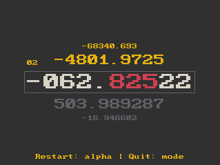

# timonkey

TI Monkey is a typing game for the TI-84 Plus CE inspired by other typing games, including monkeytype.
This project was made in C and was compiled using the [CE Toolchain](https://github.com/CE-Programming/toolchain).

### Build & Run
To build this project, 
first install the [CE Toolchain](https://github.com/CE-Programming/toolchain), 
then clone this project, 
then using a console cd into the repository 
and run `make`.

To run this project, you need a TI-84 Plus CE (Device or Emulator) that is able to run assembly programs.
You will need the clibs.8xg, which can be found [here](https://github.com/CE-Programming/libraries/releases/tag/v10.1).

### License

[MIT License](LICENSE)